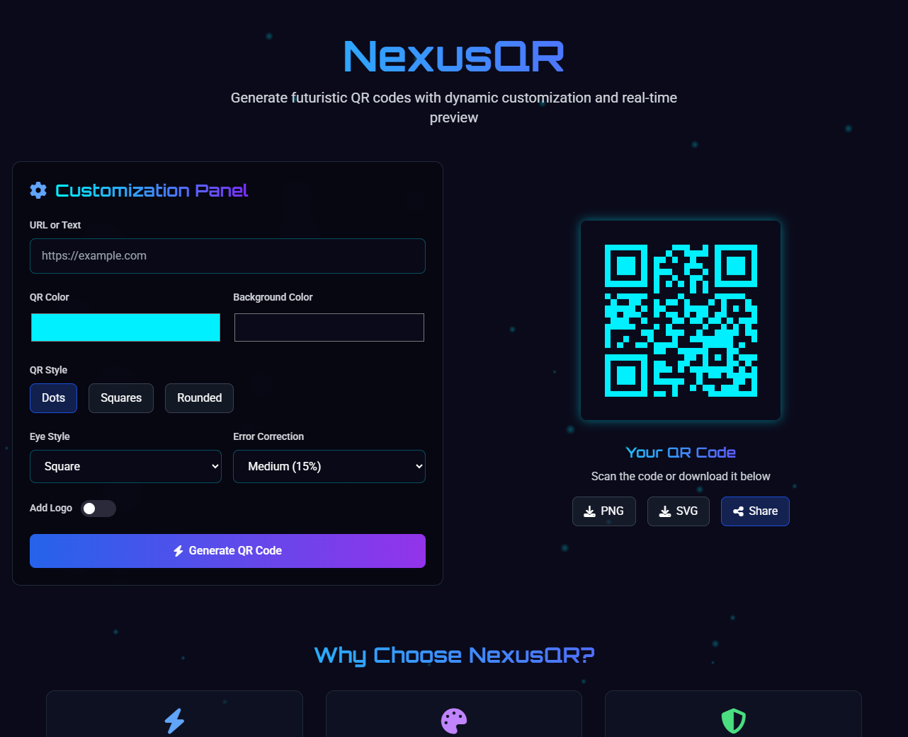

# ⚡ NexusQR – Futuristic QR Code Generator

NexusQR is a sleek and modern QR Code generator that allows users to create highly customizable QR codes in real-time.
It offers an interactive UI with live preview, multiple styles, error correction options, and download support.

---

## 🖼️ Screenshots

### 🔵 Desktop View

### 🔵 Mobile View

---

## ✨ Features

- 🔹 **Live QR Code Preview**  
  Watch your QR code update as you type.

- 🎨 **Dynamic Customization**  
  Modify QR color, background, style (dots, squares, rounded), eye style, and error correction.

- 🧩 **Add Logo Support** *(optional toggle)*

- 📱 **Responsive Design**  
  Works perfectly across all screen sizes.

- 📥 **Download Options**  
  Export your QR code in PNG or SVG format.

- ⚡ **Built with Tailwind CSS and CSS**  
  Clean, scalable, and fast styling.

---

## 🚀 Technologies Used

- **HTML5**
- **CSS**
- **Tailwind CSS** – for rapid and responsive styling
- **JavaScript** – to handle generation logic and interactivity

---

## 📁 Project Structure
QR code/
├── index.html # Main HTML structure
├── style.css # Custom CSS (if any beyond Tailwind)
├── script.js # JavaScript logic for QR generation
├── tailwind.config.js # Tailwind configuration
└── /assets # Screenshots and logo files
